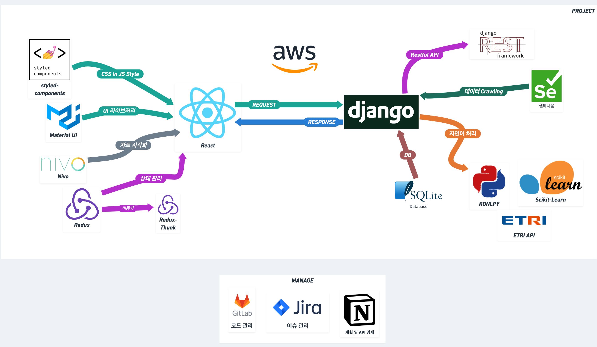
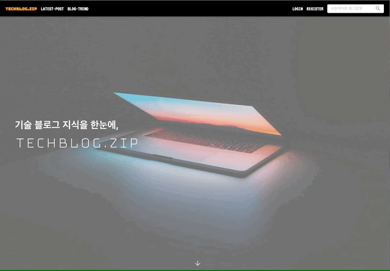

# TECHBLOG.ZIP

IT 기업 기술 블로그 수집 및 데이터 분석을 통해 개발 트렌드를 알아보는 웹앱

## 🗒 주제 선정 배경

1. 현업의 트렌드를 📈 알고 싶다면!
2. 수많은 개발 블로그, 그런데 어디서 한눈에 👀 보지?
3. 큐레이팅 🤳을 통해 줄 수 있는 다양한 가치들

## 👊 팀원

| 역할                                 | 이름   |
| ------------------------------------ | ------ |
| Team Leader / FrontEnd / Deploy      | 김승연 |
| FrontEnd Lead / Git Reviewr          | 김혁준 |
| BackEnd Lead / UCC Director          | 양예은 |
| BackEnd / Git Reviewr / Announcement | 정명한 |

## 🛠 기술 스택

### SERVER DEPLOY

- AWS EC2
- Nginx
- uWSGI
- Crontab

## 👋 시작하기 Getting Started

[FRONTEND README](frontend/README.md)

[BACKEND README](backend/README.md)

## 서비스 살펴보기

### 👐 메인페이지

### 📝 LATEST-POST

### 📈 TREND

### 🔎 SEARCH

#### 일반검색

#### 태그검색

