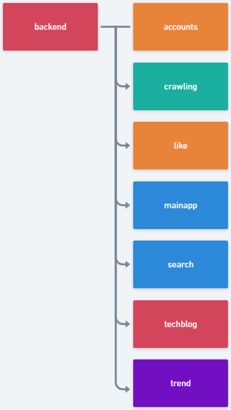

# README

## 1. 빌드 및 실행 방법

### 1. 빌드 방법

1. 프로젝트 폴더를 `git clone` 받습니다.

```bash
$ git clone https://lab.ssafy.com/s02-final/s02p31c103.git
```

2. 폴더 내부의 모든 파일이 정상적으로 받아졌는지 확인합니다.
3. `backend` 폴더로 이동합니다.

```bash
$ cd backend
```

4. 가상환경을 설정하여 전역 개발 환경과 분리합니다.

```bash
$ python -m venv venv  # Windows
$ python3 -m venv venv  # Ubuntu
```

5. 가상환경을 실행한 뒤 필요한 외부 라이브러리를 설치합니다.

```bash
$ source venv/scripts/activate  # Windows
$ source venv/bin/activate  # Ubuntu

(venv)
$ pip install -r requirements.txt  # Windows
$ pip3 install -r requirements.txt  # Ubuntu
```

6. 예시로 작성된 key 파일을 활성화하기 위해 다음 두 파일의 이름을 변경합니다.
   1. `/crawling/data/`에 위치한 `api.example.env` 파일을 `api.env`로 변경합니다.
   2. `/`(백엔드 폴더 최상위)에 위치한 `secrets.example.json` 파일을 `secrets.json`로 변경합니다.
7. 주기적인 crawling을 위한 chrome 버전에 맞는 `chromedriver` 파일을 `/crawling/crawlers/`에 넣습니다.
8. 끝!

### 2. 실행 방법

1. 가상환경이 설정된 상태에서 `SQLite3` DB를 활성화하기 위해 `migrate`를 진행합니다.

```bash
(venv)
$ python manage.py migrate  # Windows
$ python3 manage.py migrate  # Linux
```

2. `Django`를 실행하는 명령어를 입력합니다.

```bash
(venv)
$ python manage.py runserver  # Windows
$ python3 manage.py runserver  # Linux
```

## 2. 프로젝트 구조



#### 1. accounts

 **계정에 관련된 정보**를 관리하는 애플리케이션입니다. 회원가입과 로그인 및 로그아웃, 사용자 검증을 담당합니다.

#### 2. crawling

 **crawling**을 진행하는 애플리케이션입니다. `crontab`과 `selenium`을 활용하여 주기적으로 진행합니다. 수집된 데이터는 **TextRank**를 활용하여 키워드를 추출하고 이들을 **M:N** 관계로 묶어 반영합니다.

#### 3. like

**사용자의 좋아요 기능**을 담당하는 애플리케이션입니다.

#### 4. mainapp

**전체 서비스를 주관**하는 애플리케이션입니다. 각 기업별 블로그 글 읽기, 정렬, 필터링 등의 기능을 수행합니다.

#### 5. search

**검색 기능**을 수행하는 애플리케이션입니다. 일반 단어 검색을 통해 글의 제목, 본문, 태그, 회사명 등 전체에 포함된 모든 내용을 검색할 수 있으며 **#**을 붙여 특정 태그를 포함하는 글만 필터링할 수 있습니다.

#### 6. techblog

**프로젝트 설정을 관리**합니다. `django-admin startproject`로 프로젝트를 만들었을 때 가장 먼저 생성되는 폴더로 전체 설정을 관리하기 때문에 취급에 주의가 필요합니다.

#### 7. trend

**트렌드 정보 분석**을 담당하는 애플리케이션입니다. 기업별 가장 많이 사용되는 태그를 분류하여 데이터를 시각화한 결과를 제공합니다. 이 결과를 통해 새로운 인사이트를 확인하실 수 있습니다.

#### 8. 기타 폴더 내부 파일

1. `.gitignore`

   프로젝트 내부에 포함되서 안되는 파일 목록을 관리합니다.

2. `README.md`

   여러분에게 backend에 관해 설명을 제공하는 이 파일입니다.

3. `manage.py`

   **Django 서비스를 제공**하기 위한 필수 파일입니다. 취급에 주의가 필요합니다.

4. `requirements.txt`

   **서버에 필요한 외부 라이브러리들**을 모아놓은 파일입니다. `pip install -r requirements.txt`를 통해 설치할 수 있습니다.

## 3. API 구조

### AUTH

| 기능                          | API           | METHOD           |
| ----------------------------- | ------------- | ---------------- |
| 로그인                        | /auth/login/  | POST             |
| 회원가입                      | /auth/signup/ | POST             |
| JWT 검증                      | /auth/check/  | GET              |
| 회원 정보 보기 및 수정과 삭제 | /auth/myinfo/ | GET, PUT, DELETE |

### Page

| 기능                                       | API     | METHOD |
| ------------------------------------------ | ------- | ------ |
| 전체 수집 중 기업 및 포스트 개수 확인      | /home/  | GET    |
| 포스트 전체 확인 및 정렬(좋아요순, 최신순) | /posts/ | GET    |

### Trend

| 기능                                                         | API                 | METHOD |
| ------------------------------------------------------------ | ------------------- | ------ |
| **language**, **frontend**, **backend**, **lib** 상위 N개 태그 언급 횟수 | /trend/             | GET    |
| 태그 언급 날짜와 갯수                                        | /trend/tag/         | GET    |
| 회사별 일별 포스트 갯수                                      | /trend/posts/date/  | GET    |
| 기업별 상위 N개 태그 갯수                                    | /trend/company/tag/ | GET    |

### Serach

| 기능                                               | API            | METHOD |
| -------------------------------------------------- | -------------- | ------ |
| tag를 사용한 검색                                  | /search/tag/   | GET    |
| 포스트의 제목, 본문, 태그, 회사를 사용한 종합 검색 | /search/posts/ | GET    |

### Like

| 기능                                    | API                    | METHOD |
| --------------------------------------- | ---------------------- | ------ |
| 포스트 좋아요 기능                      | /like/posts/<post_id>/ | POST   |
| 사용자가 마음에 들어한 포스트 목록 확인 | /like/user/posts/      | GET    |

### ETC

| 기능             | API       |
| ---------------- | --------- |
| Swagger API 문서 | /swagger/ |
| Redoc API 문서   | /redoc/   |

## 4. 에러가 발생했을 때

### KoNLPy 모듈에 의한 jvm 오류가 발생한 경우

`KoNLPy`를 사용하기 위한 `JAVA_HOME`이 설정되어 있지 않은 경우 발생합니다. [KoNLPy 설치 사이트](https://konlpy.org/en/latest/install/)의 내용을 확인하시고 본인의 OS 환경에 맞는 설치 과정을 진행해주시면 됩니다.

### chromedriver에 의한 오류가 발생한 경우

다음 두 가지 오류 상황인지 우선 확인하신 다음 만일 해당 오류가 아닌 경우 [관리자](yye7926@naver.com)에게 연락해주시길 바랍니다.

1. `chromedriver`가 프로젝트 폴더에 존재하지 않는 경우

   본 프로젝트는 주기적인 크롤링을 위해 `chromedriver`를 사용하고 있습니다. 본인의 chrome 버전에 맞는 `chromedriver` 파일을 `/crawling/crawlers/` 내부에 넣어주시면 됩니다.

   1. Windows의 경우

      [chromedriver 설치 사이트](https://chromedriver.chromium.org/downloads)에서 chrome 버전에 맞는 windows용 `chromedriver`를 받으시면 됩니다.

   2. Ubuntu의 경우

      1. 필요 프로그램을 설치합니다.

      ```bash
      $ sudo apt-get install -y unzip xvfb libxi6 libgconf-2-4 default-jdk
      ```

      2. chrome을 설치합니다.

      ```bash
      $ sudo apt-get install -y google-chrome-stable
      ```

      3. 자신의 chrome 버전을 확인한 후 버전에 맞는 `chromedriver`를 다운받습니다.

      ```bash
      $ google-chome --version
      
      $ wget https://chromedriver.storage.googleapis.com/<YOUR_CHROME_VERSION>/chromedriver_linux64.zip
      
      $ unzip chromedriver_linux64.zip
      ```

      4. 다운받은 `chromedriver`를 `/crawling/crawlers/`로 이동시킵니다.

      ```bash
      $ mv chromedriver ~/s02p31c103/backend/crawling/crawlers/
      ```

2. `chromedriver` 버전이 올바르지 않는 경우

   본인의 chrome 버전을 확인하신 뒤 해당 버전에 맞는 `chromedriver`를 설치하시길 바랍니다.