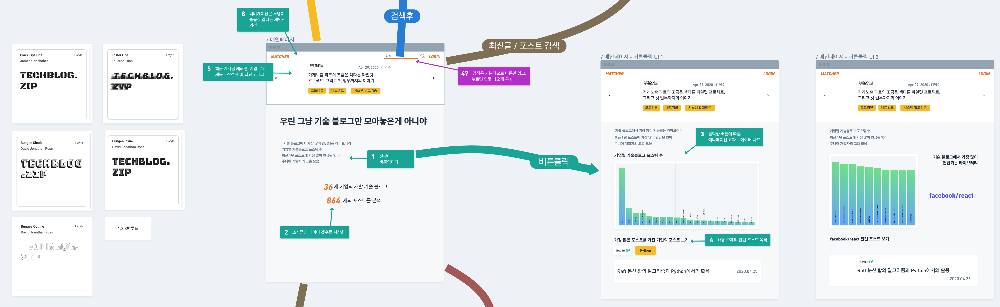

# TECHBLOG.ZIP FRONTEND

IT 기업 기술 블로그 수집 및 데이터 분석을 통해 개발 트렌드를 알아보는 웹앱

## Getting Started

### 패키지 설치 및 실행

```bash
cd frontend

npm install  # or
yarn

# 완료 후
npm run start # or
yarn start

# 빌드가 필요한 경우
npm run build # or
yarn build
```

### 백엔드 API 연결 설정

> src/client.js

```js
client.defaults.baseURL = 'BACKEND_API_ROOT_URL';
```

## 디자인

### 목업





### 완성 디자인


> **[gif 보러가기](../README.md)**
